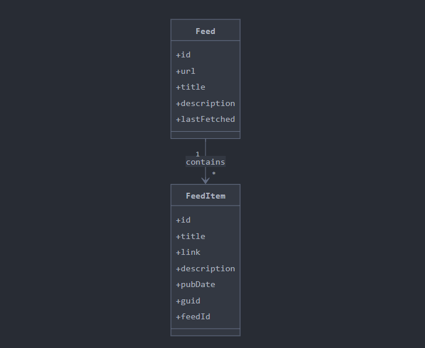

# 📰 RSS Reader – Full Stack Application

A full-stack RSS Reader application built with **Angular 19.2.7** (frontend), **Node.js 18 + Express + Sequelize** (backend), and **PostgreSQL 15** as the database. RSS feeds can be added, parsed, displayed, refreshed, updated, and deleted.

- Node.js: **v18+**
- Angular: **v19**
- PostgreSQL: **v15**
---

## Project Structure


---

## Features

- Add and manage RSS feeds
- Parse and store feed items
- View and search feed entries
- Refresh/update feed content
- Delete feeds and associated items
- Graceful error handling for invalid URLs
- Infinit scroling and UI filtering
- Fully containerized with Docker

---

## Technologies Used

- **Frontend**: Angular, RxJS, TypeScript, HTML/CSS
- **Backend**: Node.js, Express.js, Sequelize ORM
- **Database**: PostgreSQL
- **Parsing**: rss-parser
- **Containerization**: Docker, Docker Compose

---

## Setup Instructions

### 1. Clone the repo

```bash
git clone https://github.com/DrcKarim/RSSNewsReader-AngularNodeJs.git
cd rss-reader-app
```

# 2. Environment variables
 ==> You should create a user and password in PostgreSQL and replace DB_USER and DB_PASSWORD value
```bash
DB_NAME=rssreadersomone
DB_USER=karimsomone
DB_PASSWORD=karimsomone
DB_HOST=localhost
```

# 5. Frontend Commands (optional, outside Docker)
```bash
cd Frontend
npm install
ng serve
```

# 6. Backend Commands (optional, outside Docker)
```bash
cd Backend
npm install
node app.js
```

# 3. Or you can run with Docker
```bash
docker-compose up --build
```

Backend → http://localhost:3000

Frontend → http://localhost:4200

PostgreSQL runs internally via Docker

# 4. Docker Services Overview

Frontend : 4200 

Backend : 3000 

db : 5432


# 7. License 

This project is for educational purposes — customize it freely.